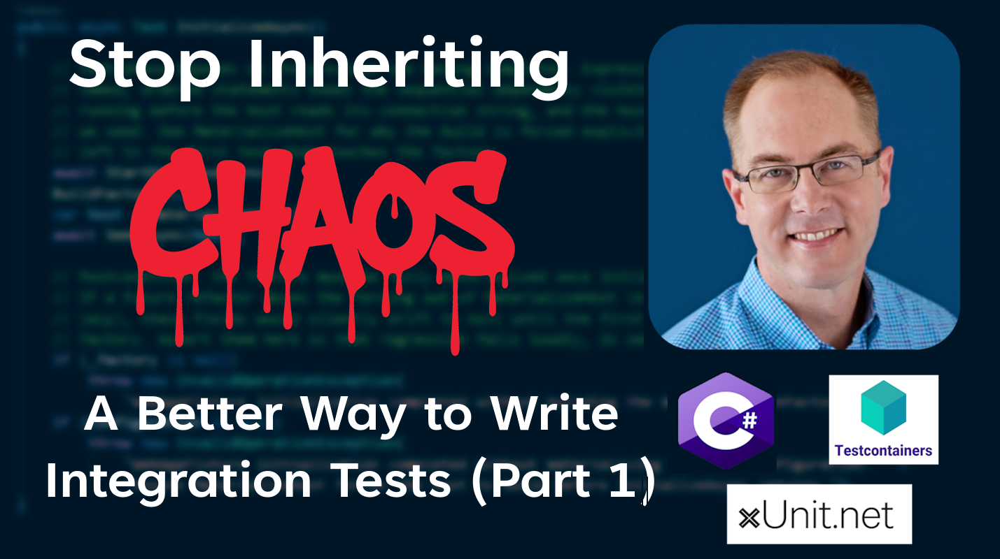
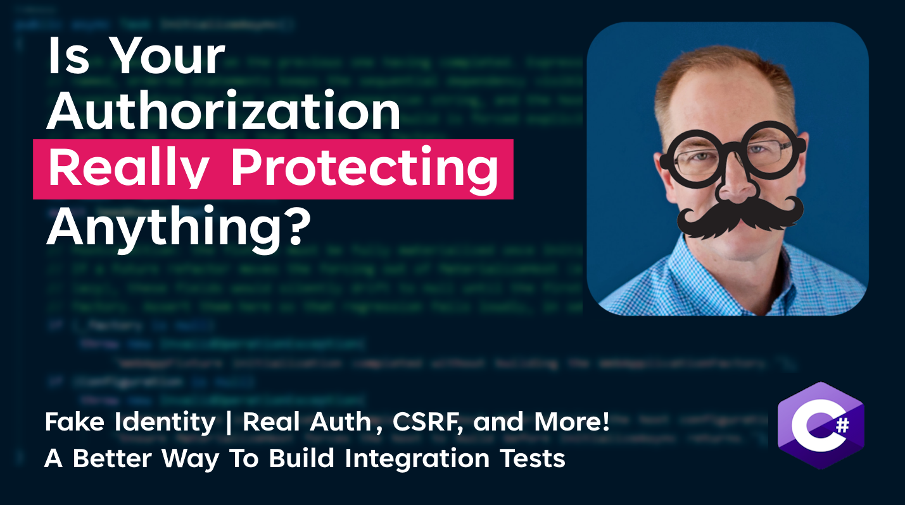

<p align="center">
  <sub><b>Sponsored by</b></sub><br/>
  <a href="https://authorizationhub.com">
    
  </a>
</p>

---

# StockPriceTracker

A small ASP.NET Core (.NET 10) minimal-API demo that tracks stock prices behind
authentication. The application itself is intentionally tiny and was "vibe coded" as
a demo — but its **integration test suite is the point of this repository**. The tests
are written deliberately, as a reusable model for testing minimal-API applications
against real infrastructure. If you're here to learn one thing, read
[`StockPriceTracker.Tests.Integration`](StockPriceTracker.Tests.Integration).

**Want these patterns in your own project?** The repo ships them as a reusable Claude Code
skill — [`.claude/skills/aspnetcore-integration-tests`](.claude/skills/aspnetcore-integration-tests).
See [Reusable Claude Code skill](#reusable-claude-code-skill) below.

<br/>

> ⭐ **If these techniques are useful to you, consider starring the repo** — it helps other
> developers find it, and it tells me if I should continue building on it.

<br/>

<p align="center">
  
  <sub><b>A Better Way to Write Integration Tests</b></sub>
</p>

<table align="center" width="100%">
  <tr>
    <td width="50%" align="center" valign="top">
      <a href="https://youtu.be/DXlmLrkP90E">
        
      </a>
      <br/>
      <sub><a href="https://youtu.be/DXlmLrkP90E"><b>Part 1</b> — Stop Inheriting Chaos</a></sub>
    </td>
    <td width="50%" align="center" valign="top">
      <a href="https://youtu.be/xrb6DX0He70">
        
      </a>
      <br/>
      <sub><a href="https://youtu.be/xrb6DX0He70"><b>Part 2</b> — Is Your Authorization Really Protecting Anything?</a></sub>
    </td>
  </tr>
</table>

## What the app does

A minimal API with JWT and cookie authentication over ASP.NET Core Identity:

| Endpoint | Method | Auth | Description |
| --- | --- | --- | --- |
| `/auth/register` | POST | Anonymous | Register an Identity user |
| `/auth/login` | POST | Anonymous | Log in, returns a JWT |
| `/antiforgery/token` | GET | Anonymous | Issue an antiforgery (CSRF) token |
| `/stocks/{ticker}` | GET | Authenticated | Look up a stock by ticker |
| `/stocks` | POST | `administrator` role | Add a new stock |

Supporting pieces: EF Core with **both SQLite and PostgreSQL** providers, an injected
`TimeProvider` for deterministic timestamps, JWT issuance via `TokenService`, and role/admin
seeding on startup.

### Project layout

```
StockPriceTracker/                     The application
  Program.cs                           Composition root; exposes `partial class Program` for tests
  Endpoints/                           Auth + Stock minimal-API endpoint groups
  Extensions/ServiceExtensions.cs      AddSqlite / AddPostgreSql / AddIdentityAndAuth
  Data/                                AppDbContext + startup DatabaseInitializer
  Services/TokenService.cs             JWT creation

StockPriceTracker.Tests.Integration/   The main event (see below)

.claude/skills/
  aspnetcore-integration-tests/        The same patterns, packaged as a reusable skill
```

## Running it

Requires the **.NET 10 SDK**. The PostgreSQL integration tests also need a running
**Docker** engine (they use [Testcontainers](https://dotnet.testcontainers.org/)).

```bash
# Run the app (SQLite by default)
dotnet run --project StockPriceTracker

# Run the full integration suite (SQLite + PostgreSQL)
dotnet test
```

> The app needs a `Jwt:Key` at startup (see `appsettings.Development.json` / user secrets).
> The tests supply their own key via `appsettings.Testing.json`, so `dotnet test` works
> out of the box.

## The integration tests — and why they're worth copying

These tests boot the **real application** in-memory with
`WebApplicationFactory<Program>` and drive it over HTTP. Several patterns here are
worth lifting into your own projects.

### 1. One test body, run against every database provider

The test logic is written **once** in a generic base class and then executed against
each database provider by declaring a thin concrete subclass per provider:

```csharp
public abstract class AddStockTestsBase<TFixture> : WebAppTestBase<TFixture>
    where TFixture : WebAppFixtureBase
{
    [Fact]
    public async Task AddStock_WithJwtAuth_CreatesANewStock_WhenDataIsValid() { /* ... */ }
}

// Same tests, two real databases — zero duplicated test code:
public class AddStockWithSqliteTests     : AddStockTestsBase<SqliteFixture>,     IClassFixture<SqliteFixture> { }
public class AddStockWithPostgreSqlTests : AddStockTestsBase<PostgreSqlFixture>, IClassFixture<PostgreSqlFixture> { }
```

You get the speed of SQLite during development **and** the fidelity of a real
PostgreSQL server — from the same assertions. Add a provider by adding one fixture and
one one-line subclass.

### 2. A shared PostgreSQL container, isolated per-fixture databases

`PostgreSqlFixture` starts **one** Testcontainers PostgreSQL container for the whole
test run (started exactly once, lazily), then hands each fixture its own uniquely-named
database inside that container:

```csharp
private static readonly PostgreSqlContainer SharedContainer = new PostgreSqlBuilder().Build();
private static readonly Lazy<Task> ContainerStart = new(() => SharedContainer.StartAsync());
private readonly string _databaseName = $"StockPriceTracker_{Guid.NewGuid():N}";
```

This is the sweet spot: pay the container startup cost once, but keep test classes
isolated from each other's data. `SqliteFixture` mirrors the same contract with a
throwaway per-fixture `.sqlite` file, so the two providers are interchangeable.

### 3. A fluent authenticated-client builder (JWT *and* cookie auth)

Tests never juggle real passwords or tokens. A single stateless test auth handler is
registered once per host and emits whatever claims you ask for, behind a fluent builder:

```csharp
var client = CreateClient()
    .WithJwtAuth(claims => claims.AsAdmin())   // or .WithCookieAuth(...)
    .Build();
```

- Authentication is configured **once per `WebApplicationFactory`**, never per test or per
  client. `Build()` reuses the fixture's single host and encodes the identity onto an
  `X-Test-Auth` request header — so a suite of N tests runs against one in-memory server, not
  N. (Creating a factory per test is the most expensive mistake in ASP.NET Core integration
  testing: each `WithWebHostBuilder(...)` boots a full app, and the parent factory retains
  every derived one.)
- `WithJwtAuth` / `WithCookieAuth` pick which **real** scheme the request declares. A policy
  scheme (`AddPolicyScheme`) forwards each request to the real registered scheme by name
  (`Bearer` / `Cookies`), so only credential validation is swapped —
  `[Authorize(AuthenticationSchemes = ...)]` and the antiforgery cookie-scheme check stay
  faithful. Requests with no identity forward to a no-op scheme that answers a clean `401`.
- The `TestAuthHandler` is **stateless**: it reads the identity from the request every time,
  so nothing leaks between tests that share the host. `ClaimsBuilder` (`AsAdmin()`,
  `AsUser(id)`, `WithRole(...)`, `WithClaim(...)`) makes the identity under test explicit.
- Because the handler injects claims directly, you test **authorization** (roles, policies)
  without standing up a login flow.

### 4. First-class CSRF / antiforgery testing

Cookie-authenticated tests exercise the real antiforgery pipeline. Clients are built
with cookie handling enabled, and extension methods make the CSRF dance a one-liner —
including the *negative* case:

```csharp
await client.WithCsrfTokenAsync();   // fetch + attach the token like a browser would
client.WithoutCsrfToken();           // prove protected calls are rejected without it
```

### 5. A deliberately sequenced, self-checking fixture lifecycle

`WebAppFixtureBase.InitializeAsync` spells out its startup as four ordered, named phases
and then **asserts its own postconditions**, so a future refactor that accidentally makes
host construction lazy fails loudly in setup instead of mysteriously later:

```csharp
await StartDatabaseAsync();   // 1. DB is up …
BuildFactory();               // 2. … before the host reads its connection string
var host = MaterializeHost();  // 3. force the host to build now, deterministically
await SeedAsync(host);        // 4. seed known data
```

The base class is heavily commented with the *why* behind each step — it's meant to be
read. It also centralizes the helpers every test needs: `ExecuteDbContextAsync(...)` for
asserting against the database, `GetService<T>()` / `CreateScope()` for reaching into DI,
and a seeded `Stocks` array of known fixtures.

### 6. Deterministic time and generated test data

`TimeProvider` is injected and replaced in the test host, so timestamps are controllable
rather than wall-clock. Request payloads are generated with
[AutoFixture](https://github.com/AutoFixture/AutoFixture), keeping tests focused on
behavior rather than hand-written sample data.

---

### Putting it together

A complete test reads top-to-bottom as *arrange the identity → act over HTTP → assert the
result*, with all the infrastructure hidden behind the base classes:

```csharp
var request = CreateRequest();
var client  = CreateClient().WithJwtAuth(claims => claims.AsAdmin()).Build();

var response  = await client.PostAsJsonAsync("/stocks", request);

Assert.Equal(HttpStatusCode.Created, response.StatusCode);
var created = await response.Content.ReadFromJsonAsync<Stock>();
Assert.Equal(request.Ticker, created!.Ticker);
```

That same test just ran against real PostgreSQL and against SQLite.

## Reusable Claude Code skill

Everything above is also packaged as a **[Claude Code](https://claude.com/claude-code) skill**
so you can apply these patterns to your own ASP.NET Core project without copying files by hand:

```
.claude/skills/aspnetcore-integration-tests/
  SKILL.md                             The workflow: setup steps, conventions, coverage checklist
  references/authorization.md          Asserting roles, policies and claims; how the test auth stack works
  references/troubleshooting.md        Symptom → cause → fix, and the anti-patterns to avoid
  templates/                           Working, copy-and-adapt source files
    WebAppFixtureBase.cs               Lifecycle, config, single-host auth registration
    WebAppTestBase.cs                  Helpers every test needs
    DatabaseFixtures/                  SqliteFixture + PostgreSqlFixture (Testcontainers)
    AuthenticationHandlers/            Stateless test auth, claims builder, CSRF extensions
    ExampleEndpointTests.cs            A complete provider-parameterised test class
    TestProgram.cs                     A test-owned host entry point
    Tests.Integration.csproj           Packages + the GC settings that keep CI from OOMing
    appsettings.Testing.json           Config so `dotnet test` works with no setup
    integration-tests.yml              GitHub Actions job with a per-provider matrix
```

### Using it

**In this repo** — it's already active. Ask Claude Code something like
*"add integration tests for the auth endpoints"* and the skill loads automatically, or invoke
it by name.

**In your own project** — copy the skill folder across:

```bash
# from the root of your project
mkdir -p .claude/skills
git clone --depth 1 https://github.com/JZuerlein/StockPriceTracker /tmp/spt
cp -r /tmp/spt/.claude/skills/aspnetcore-integration-tests .claude/skills/
```

Then ask Claude Code to *"set up integration tests for this project"*. It will work through
the setup steps — entry point, test project, fixture base, per-provider fixtures, the test
auth stack, the test base class, CI — adapting the templates to your `DbContext`, entities and
endpoints.

To make it available to **every** project on your machine, copy it to `~/.claude/skills/`
instead.

The skill also carries the reasoning, not just the code: why one `WebApplicationFactory` per
fixture (never per test), why the test auth handler must stay stateless, why a policy scheme
forwards to the *real* scheme names, and why the 401-vs-403 distinction is the part of an
authorization suite that actually proves something.

## License

Released under the [MIT License](LICENSE) — copy these testing patterns into your own
projects freely.

---

<p align="center">
  <a href="https://authorizationhub.com">
    
  </a>
</p>

## Authorization Management Plug-In Built For ASP.NET Core

**Turn Organizational Trees Into Claims.**

Most authorization rules are about groups, job roles, and people. It's been done before,
why build it again?

The power of [AuthorizationHub](https://authorizationhub.com) is that the tenants, groups,
and roles a user is related to, become identity claims as the user's request gets processed
inside the ASP.NET Core pipeline. Those claims are specific to your application and can be
used in Authorization Policies. This neatly aligns with the security model in ASP.NET Core.
It means you can change who can perform operations in your application by changing the
user's role and group memberships. There's no need to make code changes and redeploy web
applications.
